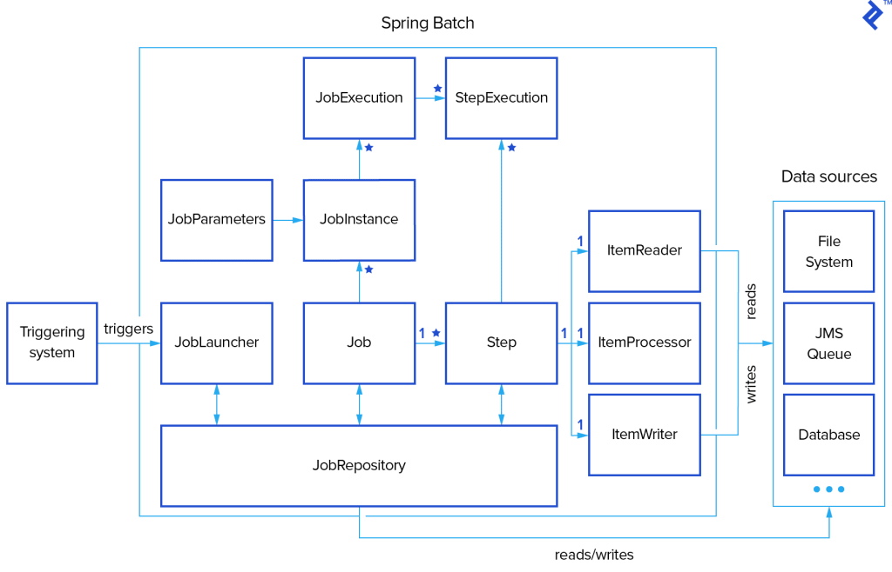

# Spring Batch
Projeto para testar algumas funcionalidades do spring batch e entender seu funcionamento e possibilidades.

Arquitetura

## Passos

1- criar os steps para os diferentes jobs
2- criar os jobs, colocando os steps e o nome dos metodos com o getname igual.
Esse dois passos em config

## Referencias:

### Launching Jobs:
https://www.toptal.com/spring/spring-batch-tutorial
https://roytuts.com/spring-batch-scheduling-multiple-jobs-parallelly/

### Configurar step v5:
https://docs.spring.io/spring-batch/docs/current/reference/html/step.html